### Brendan Lo · Software Engineer & Researcher

Building at the intersection of **software**, **cloud infrastructure**, and **computational biology** — University of Chicago.

<<<<<<< HEAD

=======

>>>>>>> f71f7c4 (Add metrics workflow and fix README image URL)

<b>Featured work</b>

 

| Project | Description | Stack |
| :--- | :--- | :--- |
| [**ReSource**](https://devpost.com/software/resource-i3nq1y) | AI-powered circular economy platform — identify and recycle items via vision + maps | Next.js, Gemini Vision, Mapbox |
| [**Force Network**](https://forcenetwork.cloud) | Hosting for 100+ game servers and 800+ users | Node.js, Docker, MongoDB, Pterodactyl |
| [**SATsaurus**](https://satsaurus.org) | Free SAT prep — practice, flashcards, and competitive 1v1 mode | Web |
| **PRC2 Drug Discovery** | ML virtual screening + MD validation for protein complex inhibition | Python, GROMACS, Schrödinger Maestro |

<b>Tech stack</b>

 

**Languages** · TypeScript · Python · Java · C# · SQL · R · Swift · JavaScript

**Frontend** · Next.js · React · Tailwind CSS

**Backend** · Node.js · Express · PostgreSQL · Supabase · MongoDB · Firebase

**Scientific** · GROMACS · Schrödinger Maestro · Matplotlib · Fiji/ImageJ · RNA-seq

**Tools** · Docker · Pterodactyl · Mapbox · Git

*Accelerating progress through tech and science.*
